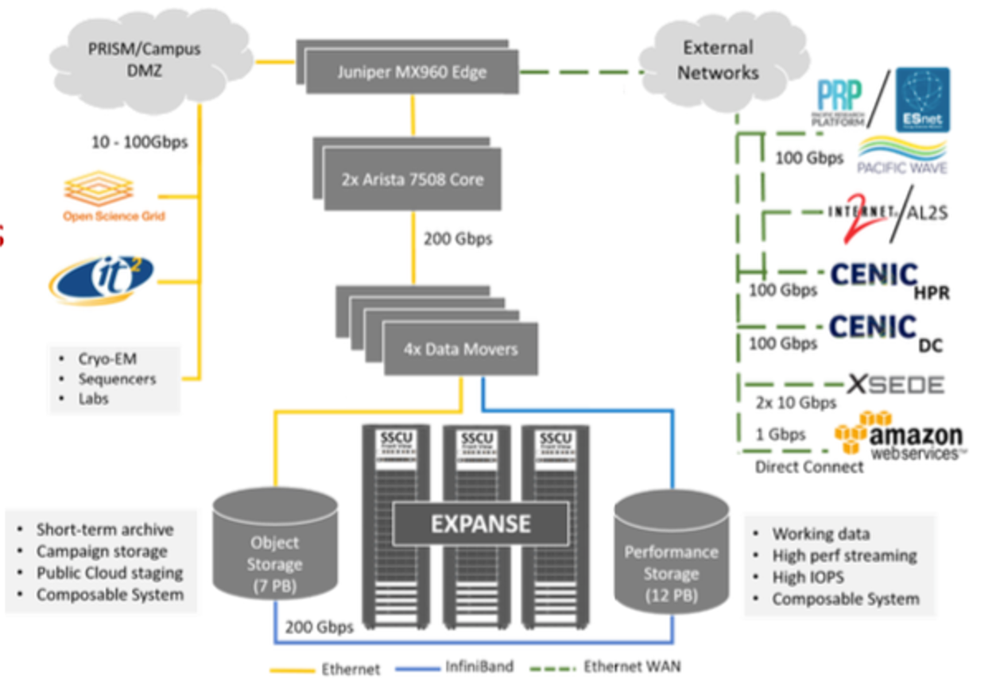

# Data and Storage, Globus Endpoints, Data Movers, Mount Points 
	IMAGE HERE:  expanse-data-arch.png

Expanse is archtected with a Data Centric Architecture. File system features include:
* Lustre parallel file system with 12 PB of usable capacity, 140 GB/s of bandwidth, 200k IOPS.
* Large fraction of the workload is dominated by many small files, the parallel file system will include multiple NVMe-based metadata servers and Lustre’s Data on Metadata capability to achieve high I/O operations per second. 
* Fast I/O Node-local, NVMe provides applications with extremely fast I/O.
* 7 PB of Ceph Object storage at SDSC for projects that need longer-term, archive-like capability over the life of their allocations.

| *DISK/IO SUBSYTEM:* | *FEATURES*| 
| ----------- | ----------- |
| File Systems | NFS, Ceph |
| Lustre Storage(performance) | 12 PB  |
| Ceph Storage |  7 PB |	
|I/O bandwidth (performance disk) | 140 GB/s, 200K IOPs|
	

	
[ [Back to Data and Storage](#data) ] [ [Back to Top](#top) ]
	
## Home File System 
[ [Back to Data and Storage](#data) ] [ [Back to Top](#top) ]

## Parallel Lustre Filesystems. 
## Local Scratch 

[ [Back to Data and Storage](#data) ] [ [Back to Top](#top) ]
## Globus Endpoints 

[ [Back to Data and Storage](#data) ] [ [Back to Top](#top) ]

	
