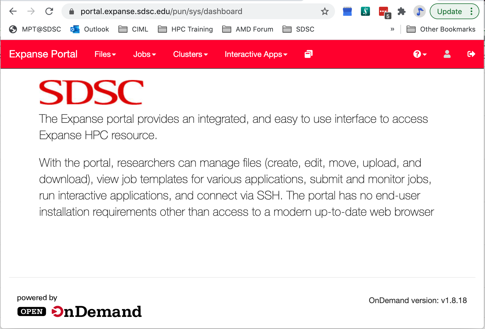

#  Getting Started on Expanse
In this Section:
* [Expanse Accounts](#get-start-expanse-accounts)
* [Logging Onto Expanse](#get-start-expanse-logon)
* [Obtaining Example Code](#get-start-example-code)
* [Expanse User Portal](#get-start-user-portal)

##  Expanse Accounts<a name="get-start-expanse-accounts"></a>
You must have a expanse account in order to access the system.
* Obtain a trial account here:  [http://www.sdsc.edu/support/user_guides/expanse.html#trial_accounts](http://www.sdsc.edu/support/user_guides/expanse.html#trial_accounts)
    * You can use your existing XSEDE account.


##  Logging Onto Expanse<a name="get-start-expanse-logon"></a>

Expanse supports Single Sign-On through the [XSEDE User Portal](https://portal.xsede.org), from the command line using an XSEDE-wide password (coming soon, the Expanse User Portal). While CPU and GPU resources are allocated separately, the login nodes are the same. To log in to Expanse from the command line, use the hostname:

```
login.expanse.sdsc.edu
```

The following are examples of Secure Shell (ssh) commands that may be used to log in to Expanse:

```
ssh <your_user>@login.expanse.sdsc.edu
ssh -l <your_user> login.expanse.sdsc.edu
```
Details about how to access Expanse under different circumstances are described in the Expanse User Guide:
https://www.sdsc.edu/support/user_guides/expanse.html#access

For instructions on how to use SSH,
see [Connecting to SDSC HPC Systems Guide](https://github.com/sdsc-hpc-training-org/hpc-security). Below is the logon message – often called the *MOTD* (message of the day, located in /etc/motd). This has not been implemented at this point on Expanse

```
[user@localhost:~] ssh -Y expanse.sdsc.edu
Welcome to Bright release         9.0

                                                        Based on CentOS Linux 8
                                                                    ID: #000002

--------------------------------------------------------------------------------

                                 WELCOME TO
                  _______  __ ____  ___    _   _______ ______
                 / ____/ |/ // __ \/   |  / | / / ___// ____/
                / __/  |   // /_/ / /| | /  |/ /\__ \/ __/
               / /___ /   |/ ____/ ___ |/ /|  /___/ / /___
              /_____//_/|_/_/   /_/  |_/_/ |_//____/_____/

--------------------------------------------------------------------------------

Use the following commands to adjust your environment:

'module avail'            - show available modules
'module add <module>'     - adds a module to your environment for this session
'module initadd <module>' - configure module to be loaded at every login

-------------------------------------------------------------------------------
Last login: Fri Nov 1 11:16:02 2020 from 76.176.117.51
```

###  Example of a terminal connection/Unix login session:

```
localhost:~ user$ ssh -l user login.expanse.sdsc.edu
Last login: Wed Oct  7 11:04:17 2020 from 76.176.117.51
[user@login02 ~]$
[user@login02 ~]$ whoami
user
[user@login02 ~]$ hostname
login01
[user@login02 ~]$ pwd
/home/user
[user@login02 ~]$
```

##  Obtaining Tutorial Example Code<a name="get-start-example-code"></a>
We will be clone the example code from GitHub repository located here:
https://github.com/sdsc-hpc-training-org/expanse-101

The example below will be for anonymous HTTPS downloads

* Create a test directory hold the expanse example files (optional):
*
```
[user@login01 TEMP]$ git clone https://github.com/sdsc-hpc-training-org/expanse-101.git
Cloning into 'expanse-101'...
remote: Enumerating objects: 275, done.
remote: Counting objects: 100% (275/275), done.
remote: Compressing objects: 100% (217/217), done.
remote: Total 784 (delta 163), reused 122 (delta 55), pack-reused 509
Receiving objects: 100% (784/784), 12.98 MiB | 20.92 MiB/s, done.
Resolving deltas: 100% (434/434), done.
Checking out files: 100% (56/56), done.
[user@login01 TEMP]$ cd expanse-101/
[user@login01 expanse-101]$ ll
total 8784
drwxr-xr-x 6 user abc123       11 Jan 28 22:39 .
drwxr-xr-x 3 user abc123        3 Jan 28 22:39 ..
-rw-r--r-- 1 user abc123     6148 Jan 28 22:39 .DS_Store
drwxr-xr-x 8 user abc123       8 Jan 28 22:39 examples
-rw-r--r-- 1 user abc123    76883 Jan 28 22:39 Expanse_Aggregate.md
drwxr-xr-x 8 user abc123       13 Jan 28 22:39 .git
-rw-r--r-- 1 user abc123      457 Jan 28 22:39 .gitignore
drwxr-xr-x 2 user abc123       16 Jan 28 22:39 images
-rw-r--r-- 1 user abc123     3053 Jan 28 22:39 README.md
-rw-r--r-- 1 user abc123  8855428 Jan 28 22:39 Webinar-Running-Jobs-on-Expanse-10-08-2020.pdf
```

*Note*: you can learn to create and modify directories as part of the *Getting Started* and *Basic Skills* preparation found here:
https://github.com/sdsc-hpc-training-org/basic_skills

The examples directory contains the code we will cover in this tutorial:

```
[user@login01 examples]$ ll
total 141
drwxr-xr-x 9 user abc123  9 Jan 28 22:44 .
drwxr-xr-x 5 user abc123  10 Jan 28 22:44 ..
drwxr-xr-x 6 user abc123   7 Jan 28 22:44 CUDA
drwxr-xr-x 6 user abc123   7 Jan 28 22:39 cuda-samples
drwxr-xr-x 2 user abc123   3 Jan 28 22:39 ENV_INFO
drwxr-xr-x 2 user abc123   6 Jan 28 22:39 HYBRID
drwxr-xr-x 2 user abc123   6 Jan 28 22:39 MPI
drwxr-xr-x 2 user abc123   6 Jan 28 22:39 OpenACC
drwxr-xr-x 2 user abc123   6 Jan 28 22:39 OPENMP

```
All examples will contain source code, along with a batch script example so you can compile and run all examples on Expanse.

##  Expanse User Portal<a name="get-start-user-portal"></a>


* See: https://portal.expanse.sdsc.edu
* Quick and easy way for Expanse users to login, transfer and edit files and submit and monitor jobs.
* Gateway for launching interactive applications such as MATLAB, Rstudio
* Integrated web-based environment for file management and job submission.
* All Users with valid Expanse Allocation and XSEDE Based credentials have access via their XSEDE credentials..


