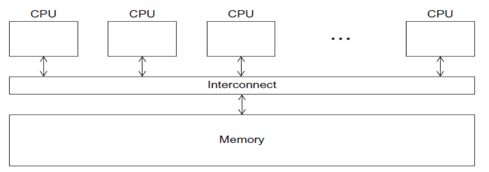

# 7. Running Jobs on Expanse

In this Section:
* [Parallel Models](#run-jobs-par-models)
* [Methods for  Running Jobs on Expanse](#run-jobs-methods)
   * [Batch Jobs](#run-jobs-methods-batch)
   * [Interactive Jobs](#run-jobs-methods-ineractive)
   * [Command Line Jobs](#run-jobs-cmdline)
* [Slurm Partitions](#run-jobs-slurm-partition)
   * [Slurm Commands](#run-jobs-slurm-commands)
   * [Slurm Batch Script Example](#run-jobs-slurm-batch)

##  Parallel Models <a name="run-jobs-par-models"></a>
###  Parallel Models: Distributed Memory


* Programs that run asynchronously, pass messages for communication and coordination between resources.
* Examples include: SOA-based systems, massively multiplayer online games, peer-to-peer apps.
* Different types of implementations for the message passing mechanism: HTTP, RPC-like connectors, message queues
* HPC historically uses the Message Passing Interface (MPI)

###  Parallel Models: Shared Memory



* CPUs all share same localized memory (SHMEM)
   * Coordination and communication between tasks via interprocessor communication (IPC) or virtual memory mappings.
* May use: uniform or non-uniform memory access (UMA or NUMA); cache-only memory architecture (COMA).
* Most common HPC API’s for using SHMEM:
   * Portable Operating System Interface (POSIX); Open Multi-Processing (OpenMP) designed for parallel computing – best for multi-core computing.

##  Methods for  Running Jobs on Expanse <a name="run-jobs-methods"></a>

###  Batch Jobs<a name="run-jobs-methods-batch"></a>

* Batch Jobs are used to submit batch scripts to Slurm from the login nodes. You need to specify
   * Partition (queue)
   * Time limit for the run (maximum of 48 hours)
   * Number of nodes, tasks per node; Memory requirements (if any)
   * Job name, output file location; Email info, configuration

* When you run in the batch mode, you submit jobs to be run on the compute nodes using the sbatch command. 
* Remember that computationally intensive jobs should be run only on the compute nodes and not the login nodes.
* Expanse places limits on the number of jobs queued and running on a per group (allocation) and partition basis.
* Please note that submitting a large number of jobs (especially very short ones) can impact the overall  scheduler response for all users.

###  Interactive Jobs<a name="run-jobs-methods-ineractive"></a>
* Interactive Jobs: Use the _srun_ command to obtain nodes for ‘real-time, live’ command line access to a compute node:
__CPU:__
```
srun --partition=debug --qos=debug-normal --pty --account=abc123 --nodes=1 --ntasks-per-node=128 --mem=248 -t 00:30:00 --wait=0 --export=ALL /bin/bash
```

__GPU:__

```
srun   --pty --account=abc123  --nodes=1   --ntasks-per-node=1   --cpus-per-task=10   -p gpu-debug  --gpus=1  -t 00:10:00 /bin/bash
```

###  Command Line Jobs <a name="run-jobs-cmdline"></a>
The login nodes are meant for compilation, file editing, simple data analysis, and other tasks that use minimal compute resources. <em>Do not run parallel or large jobs on the login nodes - even for simple tests</em>. Even if you could run a simple test on the command line on the login node, full tests should not be run on the login node because the performance will be adversely impacted by all the other tasks and login activities of the other users who are logged onto the same node. For example, at the moment that this note was written,  a `gzip` process was consuming 98% of the CPU time on the Comet HPC system:
    ```
    [user@comet-ln3 OPENMP]$ top
    ...
      PID USER      PR  NI  VIRT  RES  SHR S %CPU %MEM    TIME+  COMMAND                                      
    19937 XXXXX     20   0  4304  680  300 R 98.2  0.0   0:19.45 gzip
    ```

Commands that you type into the terminal and run on the sytem are considered *jobs* and they consume resources.  <em>Computationally intensive jobs should be run only on the compute nodes and not the login nodes</em>.

##  Slurm Resource Manager <a name="run-jobs-slurm"></a>
**Sections:**
 * [Slurm Partitions](#run-jobs-slurm-partition)
 * [Common Slurm Commands](#run-jobs-slurm-commands)
 * [Slurm Job Status States](#run-jobs-slurm-status)

Expanse uses the _Simple Linux Utility for Resource Management (Slurm)_ resource manager. Slurm is an open source, fault-tolerant, and highly scalable cluster management and job scheduling system for large and small Linux clusters  [https://Slurm.schedmd.com/documentation.html](https://Slurm.schedmd.com/documentation.html). Follow this link to the [Slurm Quick Start Guide](https://Slurm.schedmd.com/quickstart.html)

| logging on to Expanse | Slurm Architecture |
| :----- | :-----: |
|  |  |
| User logs onto Expanse, and submits a batch script to the Slurm Controller daemon | Slurm parses the batch script for correct syntax and then queues up the job until the requested resources are available |

* Slurm is the "Glue" for parallel computer to schedule and execute jobs
  * Role: Allocate resources within a cluster
  * Nodes (unique IP address)
  * Interconnect/switches
  * Generic resources (e.g. GPUs)
  * Launch and otherwise manage jobs

###  Slurm Partitions <a name="run-jobs-slurm-partition"></a>
About Partitions

|	Partition Name	|	Max Walltime	|	Max Nodes/ Job	|	Max Running Jobs	|	Max Running + Queued Jobs	|	Charge Factor	|	Comments	|
|	:----	|	:----:	|	:----:	|	:----:	|	:----:	|	:----:	|	:----	|
|	compute	|	48 hrs	|	32	|	32	|	64	|	1	|	Used for exclusive access to regular compute nodes	|
|	shared	|	48 hrs	|	1	|	4096	|	4096	|	1	|	Single-node jobs using fewer than 128 cores	|
|	gpu	|	48 hrs	|	4	|	4	|	8 (32 Tres GPU)	|	1	|	Used for exclusive access to the GPU nodes	|
|	gpu-shared	|	48 hrs	|	1	|	24	|	24 (24 Tres GPU)	|	1	|	Single-node job using fewer than 4 GPUs	|
|	large-shared	|	48 hrs	|	1	|	1	|	4	|	1	|	Single-node jobs using large memory up to 2 TB (minimum memory required 256G)	|
|	debug	|	30 min	|	2	|	1	|	2	|	1	|	Priority access to compute nodes set aside for testing of jobs with short walltime and limited resources	|
|	gpu-debug	|	30 min	|	2	|	1	|	2	|	1	|	** Priority access to gpu nodes set aside for testing of jobs with short walltime and limited resources	|
|	preempt	|	7 days	|	32	|		|	128	|	0.8	|	Discounted jobs to run on free nodes that can be pre-empted by jobs submited to any other queue (NO REFUNDS)	|
|	gpu-preempt	|	7 days	|	1	|		|	24 (24 Tres GPU)	|	0.8	|	Discounted jobs to run on unallocated nodes that can be pre-empted by jobs submitted to higher priority queues (NO REFUNDS	|

###  Slurm Job  State Codes<a name="run-jobs-slurm-status"></a>
Slurm has a large number of states. The table below lists some
of the most common states you will see. For full details, See
the section on Slurm JOB STATE CODES, at the
[Slurm Squeue data page](https://Slurm.schedmd.com/squeue.html).

| **STATE** | **LABEL** |  **DESCRIPTION** |
| :-----  | :----- | :----- |
| CA | CANCELLED | Job was explicitly cancelled by the user or system administrator.|
| C | COMPLETED  | job is Complete/Clearing |
| F | FAILED | Job terminated with non-zero exit code or other failure condition.|
| PD | PENDING | Job is awaiting resource allocation. |
| R | RUNNING | Job currently has an allocation. |
| ST | STOPPED | Job has an allocation, but execution has been stopped with SIGSTOP signal. CPUS have been retained by this job. |
| TO | TIMEOUT | Job terminated upon reaching its time limit.|

###  Common Slurm Commands <a name="run-jobs-slurm-commands"></a>
Here are a few key Slurm commands. For more information, run the `man Slurm` or see this page:

| **COMMAND** |   **DESCRIPTION** |
| :-----  | :----- |
| *scancel* | Used to signal or cancel jobs, job arrays or job steps.  |
| *sbatch* | Submit a batch script to Slurm. |
| *sinfo*  | View information about Slurm nodes and partitions.  |
| *squeue* | Used to view job and job step information for jobs managed by Slurm. |
| *srun*   | Run a parallel job on cluster managed by Slurm. |


* Submit jobs using the sbatch command:

```
$ sbatch mycode-slurm.sb 
```

* Submitted batch job 8718049.
Check job status using the squeue command.


```
$ squeue -u $USER
             JOBID PARTITION     NAME     USER      ST       TIME  NODES  NODELIST(REASON)
           8718049   compute       mycode user   PD       0:00       1               (Priority)
```

* Once the job is running:
```
$ squeue -u $USER
             JOBID PARTITION     NAME     USER    ST       TIME  NODES  NODELIST(REASON)
           8718049     debug        mycode user   R         0:02      1           expanse-14-01
```

* Cancel a running job:

```
$ scancel 8718049
```

###  Slurm Batch Script Example <a name="run-jobs-slurm-batch"></a>
Below is an example of a batch script that prints our your environment on the compute node:

```
[user@login01 ENV_INFO]$ cat env-slurm.sb 
 !/bin/bash
 SBATCH --job-name="envinfo"
 SBATCH --output="envinfo.%j.%N.out"
 SBATCH --partition=compute
 SBATCH --nodes=1
 SBATCH --ntasks-per-node=1
 SBATCH --export=ALL
 SBATCH --account=abc123
 SBATCH -t 00:01:00

#  Environment
module purge
module load slurm
module load cpu
#   perform some basic unix commands
echo "----------------------------------"
echo "hostname= " `hostname` 
echo "date= " `date` 
echo "whoami= " `whoami` 
echo "pwd= " `pwd` 
echo "module list= " `module list` 
echo "----------------------------------"
echo "env= " `env` 
echo "----------------------------------"
```

* Portion of the output generated by this script:

```
[user@login01 ENV_INFO]$ cat envinfo.108867.exp-6-56.out 
----------------------------------
hostname=  exp-6-56
date=  Wed Oct 7 23:45:43 PDT 2020
whoami=  user
pwd=  /home/user/DEMO/ENV_INFO
Currently Loaded Modules:
  1) slurm/expanse/20.02.3   2) cpu/1.0
----------------------------------
env=  SLURM_MEM_PER_CPU=1024 LD_LIBRARY_PATH=/cm/shared/apps/Slurm/current/lib64/Slurm:/cm/shared/apps/Slurm/current/lib64 LS_COLORS=rs=0

[SNIP]

 MODULESHOME=/usr/share/lmod/lmod LMOD_SETTARG_FULL_SUPPORT=no HISTSIZE=5000 LMOD_PKG=/usr/share/lmod/lmod LMOD_CMD=/usr/share/lmod/lmod/libexec/lmod Slurm_LOCALID=0 LESSOPEN=||/usr/bin/lesspipe.sh %s LMOD_FULL_SETTARG_SUPPORT=no LMOD_DIR=/usr/share/lmod/lmod/libexec BASH_FUNC_module%%=() { eval $($LMOD_CMD bash "$@") && eval $(${LMOD_SETTARG_CMD:-:} -s sh) } BASH_FUNC_ml%%=() { eval $($LMOD_DIR/ml_cmd "$@") } _=/usr/bin/env
----------------------------------
```
